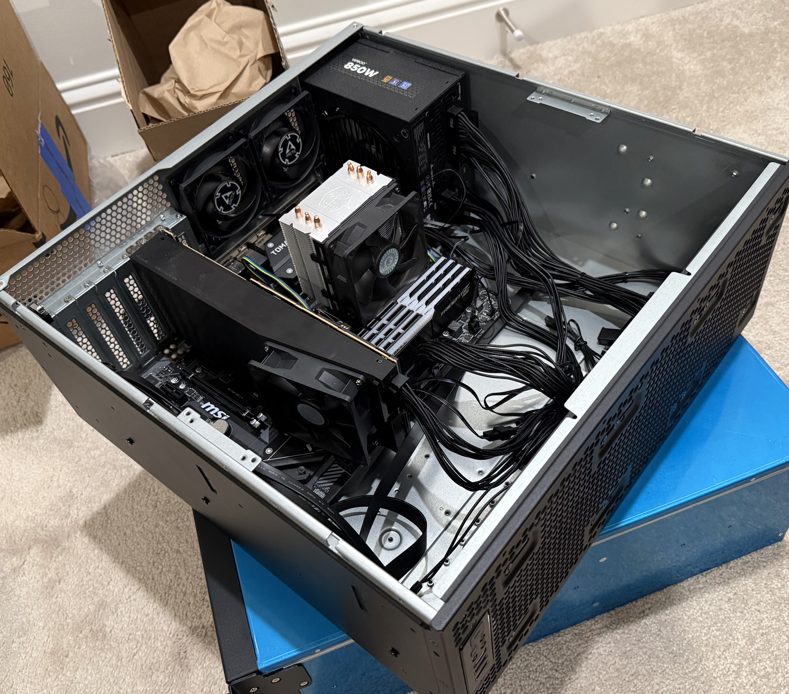
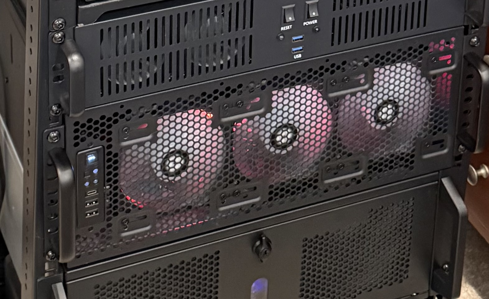

# GPU Compute Platform

## Overview

`ai-node-01` is the primary GPU compute system for the Local AI Infrastructure Platform.

It combines a conventional consumer desktop platform with an AMD Instinct MI60 32 GB datacenter accelerator and runs Proxmox VE as the host operating environment.

The node is used for:

- llama.cpp LLM inference
- ComfyUI image generation
- Vulkan testing
- ROCm testing
- GPU power-limit experimentation
- thermal testing
- model and context-size experiments

## Physical Host

The host is housed in a Silverstone RM4A 4U Chassis in the rack.

<p align="center">
  
  
</p>

## Hardware

Current core hardware:

```text
Hostname:    ai-node-01
CPU:         AMD Ryzen 5 3600
Memory:      32 GB DDR4
GPU:         AMD Instinct MI60
VRAM:        32 GB HBM2
Local Disk:  1 TB NVMe
Hypervisor:  Proxmox VE
```

The MI60 is the defining component of the node.

## AMD Instinct MI60

The AMD Instinct MI60 is a datacenter compute accelerator based on AMD's Vega-generation architecture.

Characteristics that make it interesting for local AI include:

- 32 GB of HBM2
- very high memory bandwidth
- full-size PCIe accelerator design
- ECC-capable datacenter memory
- strong capacity for models that do not fit on common 12-24 GB consumer GPUs
- no display outputs
- passive cooling
- older architecture with more complicated modern software support than current consumer cards

The MI60 was not selected because it is the fastest GPU in every workload.

Its primary attraction is the combination of 32 GB VRAM and high memory bandwidth at a cost that historically compared favorably with consumer GPUs offering similar memory capacity.

## Why 32 GB Matters

For local AI, raw graphics performance is not the only important characteristic.

A model that does not fit in VRAM may require:

- partial CPU offload
- system-memory spillover
- reduced context size
- more aggressive quantization
- a smaller model

All of those can materially change the user experience.

The MI60's 32 GB of HBM2 makes it possible to keep significantly larger workloads entirely on the GPU than many lower-capacity cards.

## Consumer Platform, Datacenter GPU

The MI60 was designed to live in a server chassis with forced front-to-back airflow.

It does not include the kind of self-contained cooler used on gaming GPUs.

That creates an important difference:

```text
Consumer GPU:
GPU + heatsink + onboard fans

MI60:
GPU + passive heatsink + expectation of chassis airflow
```

Simply installing the MI60 in a desktop chassis without directed airflow would not provide the cooling environment it was designed for.

## Cooling Design

The cooling solution therefore focuses on forcing air through the MI60 heatsink.

The GPU has a dedicated fan positioned to provide airflow through the passive cooler.

The surrounding chassis airflow supports that dedicated GPU airflow rather than replacing it.

Important considerations include:

- intake air temperature
- static pressure
- fan placement
- obstruction in front of the GPU
- exhaust path
- sustained rather than short-duration load
- GPU power limit

The current SilverStone 4U chassis provides substantially more open space and less restrictive airflow than the earlier ATX mid-tower arrangement.

This gives the MI60:

- a clearer intake path
- more room around the card
- stronger general case airflow
- easier access for cooling changes
- more flexibility for maintenance and airflow adjustments

## Chassis Migration

`ai-node-01` was previously installed in an ATX mid-tower case that required additional clearance above it to move the system in and out of the rack.

A 3U replacement was considered, but the available 3U options were not attractive for this specific workload.

The GPU requires:

- full-height PCIe clearance
- room for its dedicated cooling fan
- adequate airflow
- reasonable CPU cooler clearance
- convenient service access

Moving the node into a SilverStone 4U chassis removed those packaging constraints while freeing approximately 3U of previously unusable rack space above the old tower for another node.

The move was therefore both a thermal improvement and a rack-capacity improvement.

## Power Tuning

The MI60 is capable of drawing substantially more power than is required for every inference workload.

LLM inference, especially token generation, can be heavily influenced by memory bandwidth and model characteristics rather than scaling linearly with additional GPU power.

This makes power-limit testing useful.

The goal of power tuning is not simply to minimize wattage.

The goal is to find a useful operating point where:

- inference throughput remains high
- temperature is reduced
- fan requirements are reduced
- power consumption is lower
- the GPU remains stable under long-duration loads

Testing has shown that the MI60 can operate around the 170 W range for some inference workloads without a proportionate loss of token-generation performance.

Exact results are documented separately in `performance.md`.

## Proxmox Architecture

`ai-node-01` runs Proxmox VE rather than functioning as a single bare-metal AI workstation.

This provides:

- snapshot capability
- workload isolation
- easier rebuilds
- clean separation between services
- the ability to run multiple AI environments
- consistent management with the rest of the homelab

The goal is not to install every AI dependency directly onto the Proxmox host.

Instead, the host provides hardware and virtualization services while AI applications live in isolated workload environments.

## LXC GPU Access

LXC is used where practical because it provides a lightweight environment while still allowing direct access to relevant GPU device nodes.

Conceptually:

```text
MI60
 |
 v
Linux kernel / AMDGPU
 |
 v
Proxmox host
 |
 v
GPU device access
 |
 v
LXC workload
 |
 +--> llama.cpp
 |
 +--> ComfyUI
```

This design keeps application dependencies out of the base Proxmox environment while preserving near-native access to the GPU.

## AMD Linux Graphics Stack

For the llama.cpp workload, the relevant stack is primarily:

```text
llama.cpp
  |
  v
Vulkan
  |
  v
Mesa / RADV
  |
  v
AMDGPU kernel driver
  |
  v
MI60
```

This is distinct from ROCm.

ROCm is installed where required for workloads such as ComfyUI/PyTorch, but it is not treated as a universal requirement for every AMD AI workload.

## ROCm Use

ROCm is primarily used for workloads that depend on the PyTorch compute ecosystem.

On this platform, ComfyUI is the major example.

Running an older accelerator such as the MI60 with current ROCm software may require more compatibility work than using a current officially targeted GPU.

That makes environment isolation especially useful.

The ROCm workload can be changed or rebuilt without destabilizing the working Vulkan inference stack.

## Monitoring

Useful GPU observations include:

- GPU temperature
- memory use
- GPU utilization
- power draw
- power limit
- clock behavior
- workload throughput

The important principle is to correlate hardware telemetry with actual application performance.

A higher power draw is not automatically better if throughput remains unchanged.

Likewise, low GPU utilization does not necessarily mean a workload is misconfigured if it is constrained by another part of the inference pipeline.

## Operational Considerations

The MI60 requires more deliberate operation than a conventional consumer GPU.

Important considerations include:

- no onboard display outputs
- passive cooling assumptions
- older architecture
- ROCm compatibility
- ensuring the correct device access inside containers
- managing model sizes against available VRAM
- avoiding unnecessary host-level dependency changes
- validating stability under sustained load

These constraints are part of what makes the node useful as an infrastructure learning project rather than simply a desktop AI workstation.
