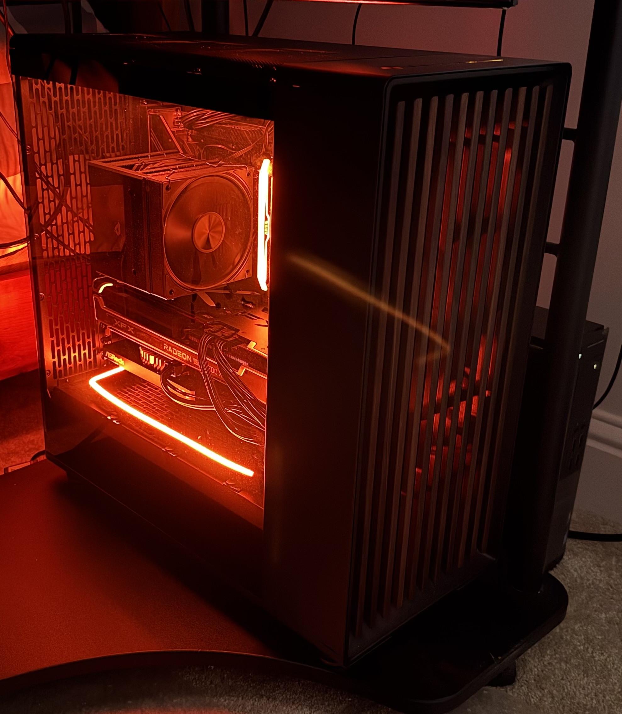
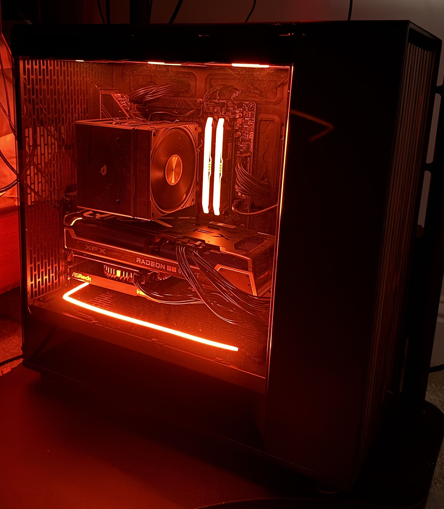

# Game Streaming Infrastructure

A homelab project focused on building a clean, high-performance game streaming platform with **Proxmox VE**, **NixOS**, **Sunshine/Moonlight**, and dedicated GPUs for rendering and encoding.

The goal is to make the system behave like a remotely accessible gaming appliance while retaining the flexibility of a virtualized Linux host.

## Project Goals

- Run the gaming environment as a VM under Proxmox VE.
- Pass through dedicated GPUs directly to the VM.
- Separate game rendering from desktop, capture, and hardware encoding duties.
- Keep the guest configuration declarative with NixOS.
- Stream games to lightweight clients through Sunshine and Moonlight.
- Support both local NVMe storage and NAS-hosted game libraries.
- Preserve a clean, conventional gaming-PC form factor rather than relying on exposed risers or external PCIe hardware.

## Architecture at a Glance

```text
Proxmox VE
└── NixOS gaming VM
    ├── RX 6700 XT
    │   └── Game rendering
    │
    └── Intel Arc A380
        ├── Labwc compositor
        ├── Headless Wayland display
        ├── Sunshine capture
        └── H.264 / HEVC / AV1 hardware encoding
```

Games are directed to the Radeon GPU while the Arc GPU owns the desktop and streaming path.

## Physical Host

The node uses a conventional desktop case with both dedicated GPUs installed internally.

<p align="center">
  
  
</p>

## Current Hardware

| Component | Role |
|---|---|
| AMD Ryzen 9 7950X3D | Host CPU |
| ASRock X870 Taichi Creator | Motherboard / PCIe platform |
| AMD Radeon RX 6700 XT 12 GB | Game rendering |
| Intel Arc A380 6 GB | Compositor, virtual display, capture, and hardware encoding |
| 32 GB DDR5 | Host memory |
| 1 TB NVMe SSD | Local VM/game storage |
| 10 GbE | Current network connection |

The gaming VM uses 16 vCPUs pinned to the 7950X3D's V-Cache CCD and receives both discrete GPUs through VFIO passthrough.

## Software Stack

```text
Proxmox VE
└── NixOS gaming VM
    ├── Labwc
    ├── Steam + Proton
    ├── Mesa RADV
    ├── MangoHud
    ├── Sunshine
    └── Intel VAAPI / iHD
```

NixOS keeps the gaming environment reproducible and appliance-like. Intel Arc hardware encoding required only the Intel media driver to be added to the graphics configuration before VAAPI exposed H.264, HEVC, HEVC Main10, and AV1 encoding.

## Current Engineering Focus

The current focus is no longer raw game performance or PCIe topology. The NixOS gaming VM is producing strong native game performance, and the move to the ASRock X870 Taichi Creator has given both GPUs CPU-direct PCIe 4.0 x8 links.

The remaining work is focused on improving frame delivery through the split-GPU streaming pipeline:

```text
RX 6700 XT
└─ Game rendering
   ↓
Cross-GPU frame handoff
   ↓
Arc A380
├─ Labwc / virtual display
├─ Sunshine capture
└─ Hardware encoding
   ↓
Moonlight

## Project Files

- [architecture.md](architecture.md) - Virtualization, VFIO, CPU pinning, Wayland, and streaming architecture
- [hardware-and-design.md](hardware-and-design.md) - Hardware selection, GPU roles, PCIe topology, networking, storage, and physical design decisions
- [performance.md](performance.md) - Quantitative streaming results, game workload observations, and planned validation tests
- [streaming-findings.md](streaming-findings.md) - Troubleshooting findings and interpretation of host, encoder, network, and client behavior
- [lessons-learned.md](lessons-learned.md) - Reusable engineering lessons from building and troubleshooting the platform

Host-specific details such as IP addresses and internal service dependencies are intentionally excluded from this public repository.

## Status

**Active project.**

Dual-GPU rendering, GPU passthrough, headless Wayland capture, and Intel Arc hardware encoding are operational under NixOS. Current testing is focused on the cross-GPU path and PCIe topology at high resolutions and refresh rates.
