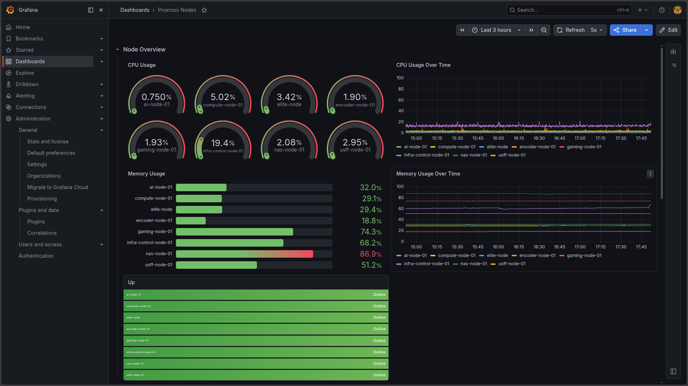

# Grafana

## Role

Grafana is the visualization layer of the observability platform.

It queries Prometheus and presents infrastructure state through dashboards intended for quick operational awareness rather than excessive detail.


<br>


<p align="center">
  
</p>

<br>

## Dashboards

Dashboards prioritize:

- Readability
- Useful operational information
- Consistent naming
- Historical context
- At-a-glance infrastructure health

## Current Dashboard Areas

### Nodes

Host dashboards provide visibility into:

- Online/offline status
- CPU utilization
- CPU utilization over time
- Memory utilization
- Memory utilization over time

### Proxmox Guests

Virtual machine and container views include:

- VM and CT counts
- Running guest counts
- CPU utilization
- Memory utilization
- Historical guest performance

Guest legends use:

```text
{{name}} ({{type}} {{vmid}})
```

This keeps guest names, virtualization type, and VMID visible together.

### UPS

UPS visualization can include:

- Battery charge
- Estimated runtime
- UPS load
- Input voltage
- Output voltage
- Online/on-battery state
- Low-battery state

## Data Source

Grafana uses Prometheus as its metrics source.

```text
Exporters
    ↓
Prometheus
    ↓
Grafana
```

Grafana does not directly query infrastructure APIs or hardware monitoring interfaces.

## Query Design

PromQL is used not only to retrieve metrics but also to normalize labels and prepare series for readable dashboard legends.

For Proxmox guests, VMID and guest metadata are retained so that panels remain understandable as the number of VMs and containers grows.
